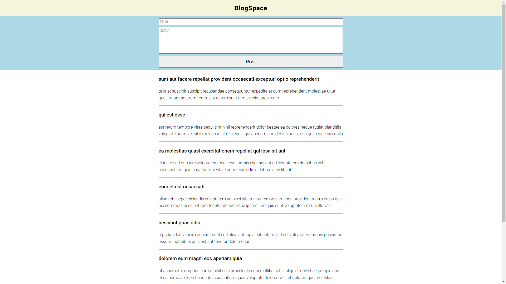

# Blogspace

A blogging site with the ability to add new posts.

## Overview

### Screenshots

### Links

-   Live Site URL: [GitHub Pages](https://dpass47.github.io/blogspace/)
-   [JSONPlaceholder API](https://jsonplaceholder.typicode.com/)

## My process

I began building this site by creating the HTML to lay out the initial building blocks for the webpage. I used a form to build the input field sections for the user to create a new post. I styled the site using CSS, and I used Google Fonts to use a specific font with great readability. I moved on to building the JavaScript logic for the application, beginning with a renderPosts function that uses a for...of statement to render and display all of the necessary posts. I used the JSONPlaceholder API to grab placeholder text to generate previous posts. I added an event listener to the post button, where it will take the data from the post to display above the previous posts. I did this by using the unshift method to the postsArray, and I reran the renderPosts function to display the new post. As part of the function, I have the post input fields reset, so the user will have a fresh pad to write another new post.

### Built with

-   HTML
-   CSS
-   JavaScript
-   JSONPlaceholder API
-   Mobile-first workflow

### What I learned

I learned more about POST requests using the Fetch API. I was able to POST the data to the API and recall it to show the new data in the posts list. I learned some more with HTML Forms too, mainly about some of the quirks with them. I used event.preventDefault() to block the default handling of submitting a form, which was something new I used during this project.

## Author

-   Website - [Dante Passalacqua](https://www.devdante.com)
-   Twitter - [@dpass47](https://www.twitter.com/dpass47)
